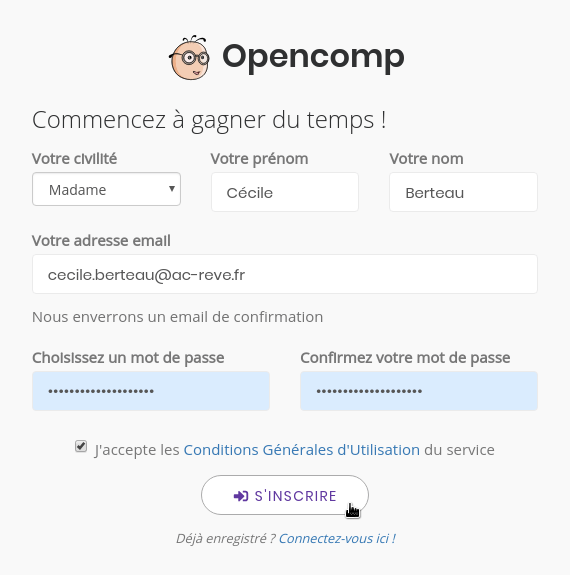
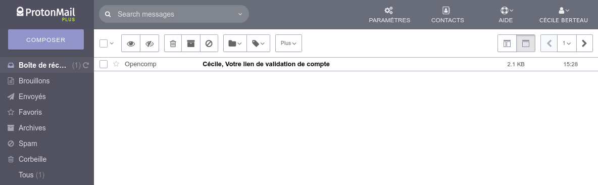
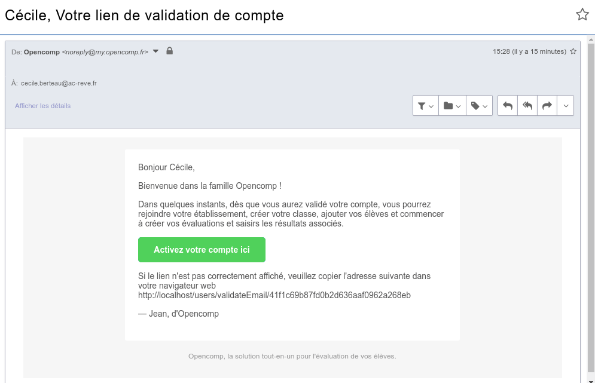
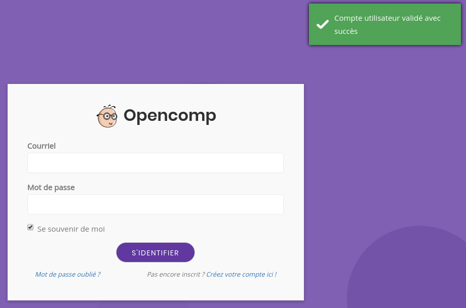

# Créer et valider mon compte

Pour créer un compte et essayer Opencomp, c'est très simple. Commencez par remplir le formulaire d'inscription disponible à l'adresse [**https://my.opencomp.fr/users/register**](https://my.opencomp.fr/users/register)\*\*\*\*


Le fait de vous inscrire **ne vous engage pas** à utiliser le produit à l'issue de la période d'essai si celui ci ne vous convenait pas ;\) **Essayez en toute liberté et sans aucune contrainte** afin de déterminer si le logiciel réponds à vos besoins.


Connectez-vous ensuite à votre boîte de messagerie électronique pour ouvrir le mail de confirmation d'inscription. Le message peut dans certain cas et pour certaines messagerie prendre quelques minutes à arriver. Dans la plupart des cas, vous devriez le recevoir très rapidement.


**Pourquoi envoyons-nous un email ?**

Nous envoyons un email afin de nous assurer que vous êtes bien propriétaire de l'adresse de courrier électronique indiquée. Puisque vous devez cliquer sur le lien de confirmation, cela empêche quelqu'un d'autre que vous de vous inscrire sans votre contentement.


Une fois le message affiché, cliquez sur le bouton **Activez votre compte ici** pour confirmer votre inscription.


Par mesure de sécurité, le lien permettant de valider votre compte n'est valide que 24 heures. Pensez à cliquer sur le lien dès réception du mail. 


Votre compte est validé, vous pouvez désormais vous identifier avec votre adresse email et le mot de passe que vous avez choisi lors de votre inscription.

