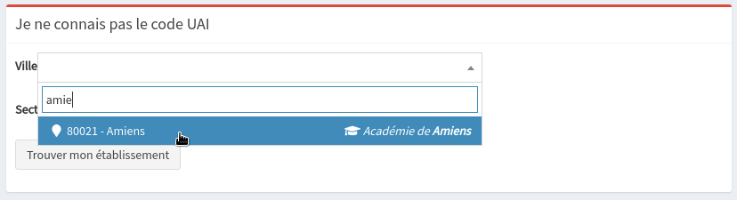
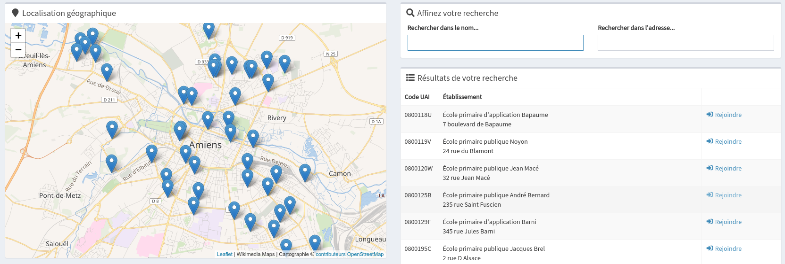
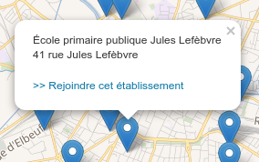
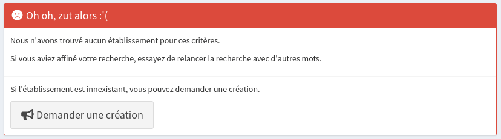
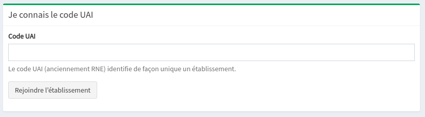
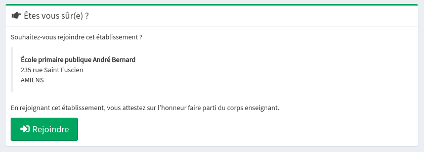

# Rejoindre mon établissement

Depuis la page d'accueil, cliquez sur le bouton "**Rejoindre mon établissement"**.

## Trouver mon établissement



Dans le cadre rouge "**Je ne connais pas le code UAI**", cliquez sur la liste déroulante "**Ville**" et commencez à taper les premières lettres de votre ville ou village.

Cliquez sur le bouton "**Trouver mon établissement**".

La page suivante répertorie toutes les écoles présentes dans cette ville/village. Dans la liste de droite, cliquez sur le lien "**Rejoindre**" correspondant à la ligne de votre établissement.


Si le nombre de résultats trouvés est trop important, n'hésitez pas à affiner votre recherche en saisissant une partie du nom de votre école \(si elle possède un patronyme\) ou une partie du nom de la rue



Vous pouvez également rejoindre une école en cliquant sur sa localisation sur la carte puis en cliquant sur le lien "**&gt;&gt; Rejoindre cet établissement**".


Dans le cas où vous n'arriveriez pas à trouver votre établissement, n'hésitez pas à cliquer sur le bouton "**Demander une création**" et à rédiger un petit courrier électronique pour nous demander de l'ajouter.




Le code UAI \(anciennement RNE\) identifie de façon unique un établissement.

Dans le cadre vert "**Je connais le code UAI**", saisissez le code UAI de votre établissement.

Cliquez sur le bouton "**Rejoindre l'établissement**".




Pour l'instant, seules les écoles élémentaires peuvent utiliser Opencomp. Si vous êtes intéressé·e pour une utilisation en collège, [inscrivez vous à notre lettre d'informations](https://opencomp.fr/actualites/) pour être tenu·e au courant des évolutions futures du produit.


## Confirmer mon appartenance à l'établissement

Confirmez ensuite votre appartenance à l'établissement en cliquant sur le bouton "**Rejoindre**".

