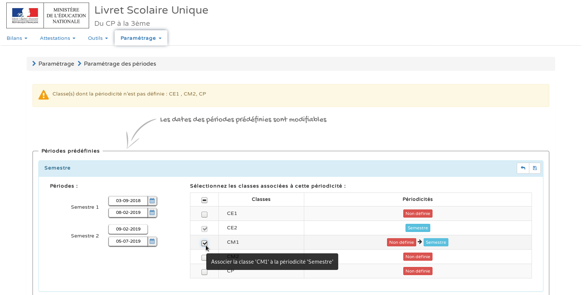

# Paramétrer les périodes


Vous pouvez modifier si vous le souhaitez les dates prédéfinies par défaut.


Cliquez sur l'icône de la disquette en haut, à droite pour valider et enregistrer vos modifications.


Vos classes sont associées à des périodes dans LSU et vous avez modifié les dates des périodes si vous le souhaitiez ; passons à la suite !


