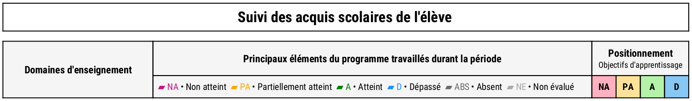
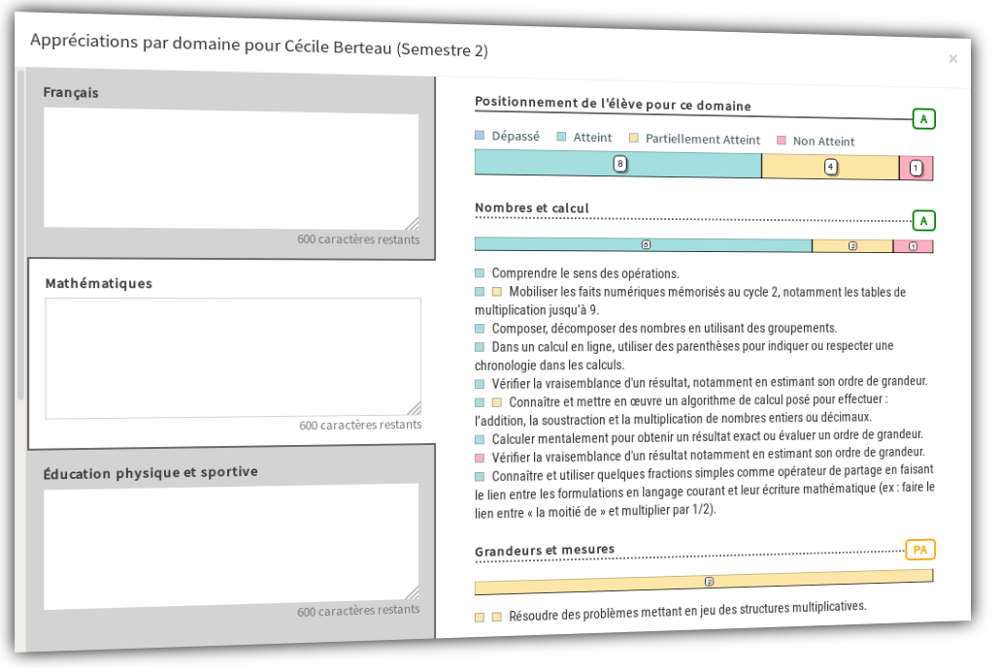

# Versions 2019

_Les mises à jour liées à la sécurité et à l'infrastructure sont indiquées par mesure de transparence mais n'entraînent aucun changement visible à votre niveau._

## v2019.5.11+003 - 19/08/2020

### 🔐 Sécurité

* Mise à jour de l'image 🐳 Docker.
  * Mise à jour de **php** vers la version **7.3.21** pour corriger de multiples vulnérabilités \(avis [CERTFR-2020-AVI-488](https://www.cert.ssi.gouv.fr/avis/CERTFR-2020-AVI-488/)\).

## v2019.5.11+002 - 15/06/2020

### 🔐 Sécurité

* Mise à jour de l'image 🐳 Docker.
  * Mise à jour de **php** vers la version **7.3.19** pour corriger de multiples vulnérabilités \(avis [CERTFR-2020-AVI-371](https://www.cert.ssi.gouv.fr/avis/CERTFR-2020-AVI-371/)\).

## v2019.5.11+001 - 17/05/2020

### 🔐 Sécurité

* Mise à jour de l'image 🐳 Docker.
  * Mise à jour de **php** vers la version **7.3.18** pour corriger de multiples vulnérabilités \(avis [CERTFR-2020-AVI-292](https://www.cert.ssi.gouv.fr/avis/CERTFR-2020-AVI-292/)\).

## v2019.5.11 - 25/04/2020

### 🍂Évolution

* Le seul changement de cette version est l'ajout d'un message d'avertissement sur la page de connexion de l'application indiquant la suppression prochaine de la connexion via Facebook.

## v2019.5.10 - 19/04/2020

### 🐛 Corrigé

* L'arbre des éléments de programmes s'affiche désormais de nouveau correctement.

## v2019.5.9+001 - 17/04/2020

### 🔐 Sécurité

* Mise à jour de l'image 🐳 Docker.
  * Mise à jour de **php** vers la version **7.3.17** pour corriger de multiples vulnérabilités \(avis [CERTFR-2020-AVI-228](https://www.cert.ssi.gouv.fr/avis/CERTFR-2020-AVI-228/)\).

## v2019.5.9 - 15/04/2020

### 🛡 Sécurité

* Mise à jour de jQuery en version 3.5.0 pour résoudre la vulnérabilité [SNYK-JS-JQUERY-565129](https://app.snyk.io/vuln/SNYK-JS-JQUERY-565129).

## v2019.5.8 - 15/04/2020

### 🐛 Corrigé

* La réinitialisation de votre mot de passe ne provoque plus d'erreur.

## v2019.5.7 - 8/04/2020

### 🛡 Sécurité

* Mise à jour des dépendances frontend🎨.

## v2019.5.6+001 - 20/03/2020

### 🔐 Sécurité

* Mise à jour de l'image 🐳 Docker.
  * Mise à jour de **php** vers la version **7.3.16** pour corriger de multiples vulnérabilités \(avis [CERTFR-2020-AVI-164](https://www.cert.ssi.gouv.fr/avis/CERTFR-2020-AVI-164/)\).

## v2019.5.6 - 15/03/2020

### 🛡 Sécurité

* Mise à jour des dépendances frontend🎨.

## v2019.5.5 - 22/02/2020

### 📋 Tâche

* Mise à jour de l'interconnexion avec le système de gestion des abonnements et de la facturation.

## v2019.5.4 - 22/02/2020

### 🔄 Dépendances

* Mise à jour des dépendances frontend🎨.

## v2019.5.3+006 - 21/02/2020

### 🔐 Sécurité

* Mise à jour de l'image 🐳 Docker.
  * Mise à jour de **php** vers la version **7.3.15** pour corriger de multiples vulnérabilités \(avis [CERTFR-2020-AVI-107](https://www.cert.ssi.gouv.fr/avis/CERTFR-2020-AVI-107/)\).

## v2019.5.3+005 - 26/01/2020

### 🔐 Sécurité

* Mise à jour de l'image 🐳 Docker.
  * Mise à jour de **php** vers la version **7.3.14** pour corriger de multiples vulnérabilités \(avis [CERTFR-2020-AVI-054](https://www.cert.ssi.gouv.fr/avis/CERTFR-2020-AVI-054/)\).

## v2019.5.3+004 - 23/12/2019

### 🔐 Sécurité

* Mise à jour du certificat d’extraction à l’origine pour l'authentification des certificats du [service d’extractions à l’origine authentifiées de Cloudflare](https://support.cloudflare.com/hc/fr-fr/articles/204899617-Extractions-%C3%A0-l-origine-authentifi%C3%A9es).
* Mise à jour de l'image 🐳 Docker.
  * Mise à jour de **php** vers la version **7.3.12** pour corriger de multiples vulnérabilités \(avis [CERTFR-2019-AVI-641](https://www.cert.ssi.gouv.fr/avis/CERTFR-2019-AVI-641/)\).

## v2019.5.3+003 - 22/11/2019

### 🔄 Dépendances

* Mise à jour de l'image 🐳 Docker.
  * Mise à jour de **php** vers la version **7.3.12**.

## v2019.5.3+002 - 28/10/2019

### 🔐 Sécurité

* Mise à jour de l'image 🐳 Docker.
  * Mise à jour de **php** vers la version **7.3.11** pour corriger de multiples vulnérabilités \(avis [CERTFR-2019-AVI-534](https://www.cert.ssi.gouv.fr/avis/CERTFR-2019-AVI-534/) et alerte [CERTFR-2019-ALE-014](https://www.cert.ssi.gouv.fr/alerte/CERTFR-2019-ALE-014/)\).

## v2019.5.2 & v2019.5.3 - 30/09/2019

### 🔄 Dépendances

* Mise à jour des dépendances backend.

### 🔐 Sécurité

* Mise à jour de l'image 🐳 Docker.
  * Mise à jour de **php** vers la version **7.3.10** pour corriger de multiples vulnérabilités \(avis [CERTFR-2019-AVI-470](https://www.cert.ssi.gouv.fr/avis/CERTFR-2019-AVI-470/)\).

## v2019.5.1 - 26/09/2019

### 🐞 Corrigé

* Les noms de famille composés n'étant pas séparés d'un ou plusieurs traits d'union mais uniquement d'un espace s'affichent désormais tous avec la première lettre en majuscule sur les copies d'évaluations générées.

## v2019.5.0 - 11/09/2019

### 🔄 Mise à jour du système d'abonnement

* Le système de paiement a été mis à jour pour être conforme au [règlement UE 2018/389](https://eur-lex.europa.eu/legal-content/FR/TXT/PDF/?uri=CELEX:32018R0389&from=FR) de la DSP2 \(Directive sur les Services de Paiements\) imposant notamment l'authentification forte du client pour les paiements par carte bancaire 💳 supérieurs ou égaux à 30€ et qui entrera en action à partir du 14 Septembre 2019 \(vous êtes maintenant redirigés vers Stripe pour la partie paiement\).
* Le bloc **Mon abonnement** de la page **Mon compte** vous informe désormais sur la date de prochain renouvellement de votre abonnement personnel \(date de prochaine facture\) et la carte bancaire qui sera utilisée pour le renouvellement.
* Vous pouvez désormais payer votre abonnement personnel en utilisant **Apple Pay** si vous utilisez un Macbook doté de **Touch ID**.
* Les abonnements établissement réglés par carte bancaire sont désormais automatiquement validés et la clé de licence correspondante envoyée par courriel automatiquement \(vous pouvez bien entendu toujours régler par chèque bancaire, virement SEPA ou mandat administratif si besoin\).

## v2019.4.5 - 04/09/2019

### 🔄 Dépendances

* Mise à jour de l'image 🐳 Docker vers la branche 🏔 Alpine 3.10.
* Mise à jour des dépendances frontend.

## v2019.4.4 - 27/08/2019

### 🔐 Sécurité

* Mise à jour de l'image 🐳 Docker.
  * Mise à jour de **eslint-utils** vers la version **1.4.1** pour corriger la vulnérabilité [CWE-94](https://cwe.mitre.org/data/definitions/94.html).
  * Mise à jour de **select2** vers la version **4.0.9** pour corriger la vulnérabilité [CVE-2016-10744](https://cve.mitre.org/cgi-bin/cvename.cgi?name=CVE-2016-10744).

## v2019.4.2 - 10/08/2019

###  🔐 Sécurité 

* Mise à jour de l'image 🐳 Docker.
  * Mise à jour de **expat** vers la version **2.2.7-r0** pour corriger la vulnérabilité [CVE-2018-20843](https://cve.mitre.org/cgi-bin/cvename.cgi?name=CVE-2018-20843).
  * Mise à jour de **libjpeg-turbo** vers la version **1.5.3-r5** pour corriger la vulnérabilité ****[CVE-2018-14498](https://cve.mitre.org/cgi-bin/cvename.cgi?name=CVE-2018-14498).
  * Mise à jour de **musl** vers la version **1.1.20-r5** pour corriger la vulnérabilité [CVE-2019-14697](https://cve.mitre.org/cgi-bin/cvename.cgi?name=CVE-2019-14697).

## v2019.4.1 - 13/07/2019

### 🔐 Sécurité

* Mise à jour de l'image 🐳 Docker.
  * Mise à jour de **lodash** vers la version **4.17.12** pour corriger la vulnérabilité [CVE-2019-10744](https://cve.mitre.org/cgi-bin/cvename.cgi?name=CVE-2019-10744).

## v2019.4.0 - 07/07/2019

Voir le billet de blog [v2019.4.0 publiée avec impression "synthèse classe" et améliorations de l'éditeur d'évaluations et d'exercices](https://opencomp.fr/actualites/v201940-publiee-avec-impression-synthese-classe-et-ameliorations-de-lediteur-devaluations-et-dexercices-118).

## v2019.3.0 & v2019.3.1 - 22/06/2019

### ✨ Amélioré

* Les éléments de programme pour lesquels l'élève a été marqué **Non évalué** ou **Absent** apparaissent désormais dans la colonne "_**Principaux éléments du programme travaillés durant la période**_" de l'impression "_**Livrets "type" LSU**_" et de l'export vers LSU ainsi que dans l'impression "**Résultats détaillés**" car les éléments ont en effet été travaillés mais l'enseignant a choisi de ne pas les évaluer \(ou il n'a pas été possible d'évaluer car l'élève était absent lors de l'évaluation et qu'elle n'a pas été rattrapée\). Ces éléments de programme marqués **Non évalué** ou **Absent** sont ignorés dans [le calcul du positionnement du domaine](../foire-aux-questions/determination-des-resultats.md#current-article-title).

* Les éléments de programme pour lesquels l'élève a été marqué **Absent** apparaissent avec un **parallélogramme gris foncé** dans l'impression "_Livrets "type" LSU_".
* Les éléments de programme pour lesquels l'élève a été marqué **Non évalué** apparaissent avec un **parallélogramme gris clair** dans l'impression "_Livrets "type" LSU_".
* Si l'ensemble des éléments de programme d'un domaine ou d'un sous domaine d'enseignement pour un élève et une période donnée sont marqués comme **Non évalué** ou **Absent**, alors, le domaine ou le sous domaine d'enseignement sera marqué comme **Non évalué** globalement lors de l'export vers LSU.

ℹ Pour rappel, pour qu'un bilan périodique soit considéré comme complet, au moins 3 acquis doivent être complets, c’est à dire que pour au moins 3 domaines \(ou 3 sous-domaines de 3 domaines différents\) :

* le domaine ou le sous domaine d'enseignement ne doit pas comporter uniquement des éléments de programmes étant marqués comme **Non évalué** ou **Absent**,
* au moins un élément de programme et le positionnement sont renseignés pour le domaine ou le sous domaine d'enseignement évalué.

### 🐞 Corrigé

* Les appréciations générales rédigées dans un traitement de texte externe \(Word, OpenOffice.org, LibreOffice, etc.\) ou un tableur externe \(Excel, OpenOffice.org, LibreOffice, etc.\) et contenant des sauts de lignes puis copiées/collées ne provoquent plus de non conformité lors de la génération du fichier d'export LSU \(les sauts de lignes sont supprimés à la volée lors de la génération\).

## v2019.2.2+002 - 14/06/2019

###  🔐 Sécurité

* Mise à jour de l'image 🐳 Docker.
  * Mise à jour de **curl** vers la version **7.64.0-r2** pour corriger les vulnérabilités [CVE-2019-5435](http://cve.mitre.org/cgi-bin/cvename.cgi?name=CVE-2019-5435) et [CVE-2019-5436](http://cve.mitre.org/cgi-bin/cvename.cgi?name=CVE-2019-5436).

## v2019.2.2 - 06/06/2019

### 🔄 Dépendances

* Les dépendances utilisées ont été mises à jour.

## v2019.2.1+002 - 03/06/2019

### 🔐 Sécurité

* Mise à jour de l'image 🐳 Docker.
  * Mise à jour de PHP vers la version [7.3.6](https://www.php.net/ChangeLog-7.php#7.3.6) pour corriger de multiples vulnérabilités \(avis [CERTFR-2019-AVI-243](https://www.cert.ssi.gouv.fr/avis/CERTFR-2019-AVI-243/)\). Vulnérabilités [CVE-2019-11040](http://cve.mitre.org/cgi-bin/cvename.cgi?name=CVE-2019-11040), [CVE-2019-11038](http://cve.mitre.org/cgi-bin/cvename.cgi?name=CVE-2019-11038) et [CVE-2019-11039](http://cve.mitre.org/cgi-bin/cvename.cgi?name=CVE-2019-11039).

## v2019.2.0 & v2019.2.1 - 26/04/2019

### ✨ Nouvelle fonctionnalité

* Le **panneau de saisie des appréciations par domaine d'enseignement** a été entièrement refondu dans la nouvelle version v2019.2.0 pour plus de praticité !

_Le panneau est maintenant divisé en deux parties :_

* La partie gauche sert à rédiger vos appréciations \(comme avant\).
* La partie droite est **dynamique** et affiche **de façon contextuelle** le détail des éléments de programmes évalués pour l'élève, la période et le domaine d'enseignement sélectionné.

### 🔐 Sécurité 

* Mise à jour de PHP vers la version [7.3.4](https://www.php.net/ChangeLog-7.php#7.3.4) pour corriger de multiples vulnérabilités \(avis [CERTFR-2019-AVI-146](https://www.cert.ssi.gouv.fr/avis/CERTFR-2019-AVI-146/)\).

## v2019.1.11 - 18/03/2019

### 🐞 Corrigé

* Lors de l'édition des synthèses, des résultats détaillés et des livrets "type" LSU, les évaluations dont la case "Ne pas exporter vers LSU" a été cochée ne sont plus prises en compte dans les documents générés. \(Le comportement est ainsi identique à l'export LSU\).
* Lorsqu'un élève a été marqué "Absent" ou "Non évalué" pour certains éléments de programme, les intitulés de ces derniers n’apparaissent plus dans la colonne _"Principaux éléments du programme travaillés durant la période"_ de l'export LSU.
* Il est de nouveau possible d'exporter l'ensemble des classes d'un établissement depuis le menu _"Export étab. vers LSU"_ \(directeurs uniquement\).

### ⏲ Performances améliorées

* L'export vers LSU \(affichage de la page "Export LSU" et téléchargement du fichier XML\) est maintenant bien plus rapide \(temps de génération du fichier XML amélioré\).

## v2019.1.10 - 18/03/2019

### 🔐 Sécurité

* Mise à jour de l'image 🐳 Docker. 
  * Mise à jour de **openssl** vers la version 1.1.1b-r1 \(résolution de la vulnérabilité [CVE-2019-1543](https://nvd.nist.gov/vuln/detail/CVE-2019-1543)\).

## v2019.1.9 - 09/03/2019

### 🔐 Sécurité

* Mise à jour de l'image 🐳 Docker.
  * Mise à jour vers la branche [Alpine 3.9.x](https://alpinelinux.org/posts/Alpine-3.9.0-released.html) \(résolution de la vulnérabilité [CVE-2018-19486](https://nvd.nist.gov/vuln/detail/CVE-2018-19486) dans git\).
  * Mise à jour de PHP vers la version [7.3.3](https://www.php.net/ChangeLog-7.php#7.3.3) pour corriger de multiples vulnérabilités \(avis [CERTFR-2019-AVI-093](https://www.cert.ssi.gouv.fr/avis/CERTFR-2019-AVI-093/)\). Vulnérabilités [CVE-2019-9637](https://nvd.nist.gov/vuln/detail/CVE-2019-9637), [CVE-2019-9638](https://nvd.nist.gov/vuln/detail/CVE-2019-9638), [CVE-2019-9639](https://nvd.nist.gov/vuln/detail/CVE-2019-9639), [CVE-2019-9640](https://nvd.nist.gov/vuln/detail/CVE-2019-9640), [CVE-2019-9641](https://nvd.nist.gov/vuln/detail/CVE-2019-9641).

### 🎨 Interface

* Lorsque vous n'avez pas encore la possibilité d'accéder à l'écran "_Appréciations et impressions_", l'icône est désormais correctement affichée en gris léger au lieu de gris foncé.

## v2019.1.8 - 03/03/2019

### 🐞 Corrigé

* La redirection vers la classe dans laquelle est ajouté, modifié ou supprimé un élève est maintenant correcte \(régression v2019.1.\*\)

### ⏲ Performances améliorées

* Utilisation des compteurs mis en cache pour la récupération de la liste des évaluations pour lesquelles des résultats n'ont pas été saisis \(tableau de bord des classes\).
* Suppression de la récupération des statistiques lors de l'édition des appréciations par domaine d'un élève. L'affichage de cette fenêtre modale est désormais bien plus rapide.

## v2019.1.7 - 26/02/2019

### 🔐 Sécurité

* Mise à jour du framework CSS et Javascript Bootstrap vers la version 3.4.1 pour corriger une vulnérabilité de type XSS \(cross-site scripting\). [CVE-2019-8331](https://nvd.nist.gov/vuln/detail/CVE-2019-8331)
* Les versions des dépendances backend et frontend utilisées sont désormais surveillées quotidiennement pour s'assurer qu'elles ne contiennent pas de vulnérabilités rendues publiques.
* L'image 🐳 Docker d'Opencomp construite à chaque mise en production est maintenant surveillée quotidiennement afin de s'assurer que les paquets installés ne contiennent pas de vulnérabilités rendues publiques.

## v2019.1.6 - 26/02/2019

### 🐘 Mise à jour de dépendances

* L'extension de gestion des utilisateurs utilisée a été mise à jour.

### 🚢 [Intégration continue](https://fr.wikipedia.org/wiki/Int%C3%A9gration_continue) & déploiement continu

* Les pipelines déclenchées par la plateforme d'intégration continue et de déploiement continu          🦊Gitlab tirent maintenant parti de la mise en cache ce qui a pour conséquence des temps de traitement raccourcis \(mise en production de nouvelles versions plus rapides\).

## v2019.1.4 & v2019.1.5 - 22/02/2019

### 🐞 Corrigé

* Il est de nouveau possible de sélectionner les élèves évalués lors de la création ou de la modification d'une évaluation \(régression v2019.1.3\).

## v2019.1.3 - 22/02/2019

### 📈 Statistiques

* Ajout du code de suivi Matomo Tag Manager pour collecter des statistiques de visite. Les statistiques sont collectées et traitées en interne \(le serveur collectant les données est opéré par Opencomp\). Matomo est une solution libre de mesure d'audience \(concurrente de Google Analytics\) et hébergeable.

### 🍂 Nettoyage de code

* Suppression de code inutile pour l'écran affichant les élèves d'une classe.

## v2019.1.1 & v2019.1.2 - 19/02/2019

### 🚢 [Intégration continue](https://fr.wikipedia.org/wiki/Int%C3%A9gration_continue) & déploiement continu

* Transmission des informations concernant la [couverture de code](https://fr.wikipedia.org/wiki/Couverture_de_code) \(la proportion de code source couvert par des tests automatisés\) à [SonarQube](https://fr.wikipedia.org/wiki/SonarQube) \(logiciel permettant de mesurer la qualité du code source en continu\).

## v2019.1.0 - 19/02/2019

### ✨ Nouvelles fonctionnalités

Vous pouvez désormais imprimer plusieurs types de documents, **directement depuis Opencomp** comme par exemple :

* - La **synthèse des résultats** de chaque élève pour une période donnée, présentée sous forme de graphiques en couleurs \(une version spéciale pour l'impression en noir & blanc est également proposée\)

* - Les **résultats détaillés** des élèves pour une période donnée sous la forme de tableaux indiquant les différentes connaissances et compétences évaluées avec le résultat obtenu pour chaque compétence \(trié par domaine et sous domaine d'enseignement\).

* - Le **suivi des acquis scolaires de l'élève** \(livret de "type" LSU reprenant le contenu obligatoire spécifié par les annexes [I](https://www.legifrance.gouv.fr/affichTexte.do?cidTexte=JORFTEXT000031742317#LEGIARTI000032615787) et [II](https://www.legifrance.gouv.fr/affichTexte.do?cidTexte=JORFTEXT000031742317#LEGIARTI000032615789) de [l'Arrêté du 31 décembre 2015 fixant le contenu du livret scolaire de l'école élémentaire et du collège](https://www.legifrance.gouv.fr/affichTexte.do?cidTexte=JORFTEXT000031742317)\)\*.

Découvrez vite ces nouveautés en vous connectant puis en sélectionnant le menu "**Appréciations & Impressions**" dans votre classe Opencomp. Cherchez ensuite le menu "**Imprimer**" à gauche des en-têtes de chaque colonne de période.

_\* Même si vous imprimez et communiquez le suivi des acquis scolaires de l'élève type "LSU" depuis Opencomp, n'oubliez pas que_ [_l'Article 8_](https://www.legifrance.gouv.fr/affichTexte.do?cidTexte=JORFTEXT000031742317#LEGIARTI000031842235) _de_ [_l'Arrêté du 31 décembre 2015 fixant le contenu du livret scolaire de l'école élémentaire et du collège_](https://www.legifrance.gouv.fr/affichTexte.do?cidTexte=JORFTEXT000031742317) _impose une transmission à chaque changement d'école d'un élève. Le Ministère de l'Education Nationale_ [_recommande cependant sur Eduscol_](http://eduscol.education.fr/cid108327/foire-aux-questions-du-livret-scolaire-unique.html#Ca3) _une fréquence de transmission à l'application nationale LSU régulière \(par exemple, à chaque fin de période\)._

## v2019.0.2 - 23/01/2019

### 🐞 Corrigé

* La page "Mes factures" vous permet désormais de télécharger correctement vos factures après avoir souscrit un abonnement Opencomp. Auparavant, les factures n'apparaissaient pas dans cet écran et il était uniquement possible de les télécharger depuis l'écran "Mes commandes" pour les commandes facturées.

## v2019.0.1 - 13/01/2019

### 🗑 Supprimé

Dans un effort de réduire l'utilisation de services externes quand cela n'est pas nécessaire pour un plus grand respect de la vie privée des utilisateurs, les services tiers suivants ne sont désormais plus utilisés :

* Le service externe "Gravatar" permettant d'afficher automatiquement l'avatar d'un utilisateur en fonction de son adresse de courriel n'est désormais plus utilisé.
* Le service externe "Google Fonts" n'est désormais plus utilisé pour le chargement de la police de caractères "Source Sans Pro". La police est chargée directement depuis le serveur Opencomp.

## v2019.0.0 - 13/01/2019

### ✨ Nouvelle fonctionnalité

* Il est désormais possible de radier un élève. Lorsqu'un élève est radié, il n'est plus proposé dans les élèves ayant passé l'évaluation lors de la création de nouvelles évaluations.

Pour marquer un élève comme étant radié, éditez simplement l'élève depuis votre liste en cliquant sur le lien "Modifier" et cochez la case "Radié".

