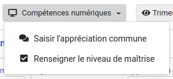
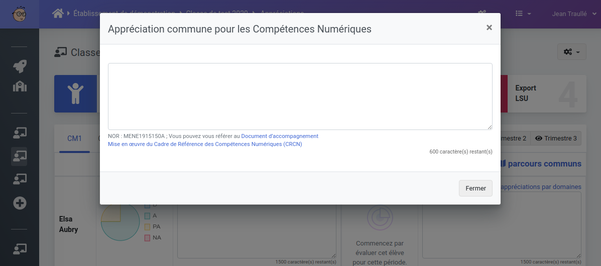
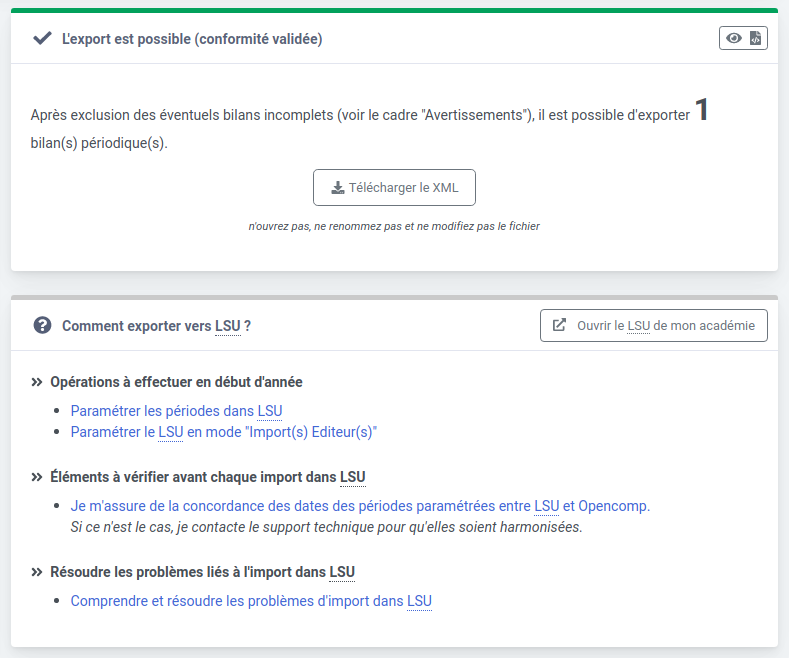
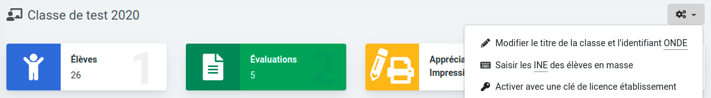

# Version majeure 2021

_Les mises à jour liées à la sécurité et à l'infrastructure sont indiquées par mesure de transparence mais n'entraînent aucun changement visible à votre niveau._

## v2021.1.1 - 13/05/2021

### 🐞 Corrigé

* Il est de nouveau possible d'afficher l'écran des appréciations par domaine d'enseignement pour chaque élève \(_régression 2021.1.0_\).

## v2021.1.0 - 13/05/2021

### 🆕 Nouvelles fonctionnalités

* Un nouveau menu fait son apparition au sein de l'écran de saisie des appréciations pour vous permettre de renseigner les éléments liés aux compétences numériques.

* Il est désormais possible de saisir une appréciation générale concernant les compétences numériques travaillées durant l'année au sein de la classe.

* Il est désormais possible de renseigner le niveau de maîtrise pour les différentes compétences numériques travaillées durant l'année pour chaque élève.

* La partie droite de l'export vers LSU a été simplifiée pour être plus claire qu’auparavant. Vous trouverez désormais des liens directs vers l'aide en ligne illustrée de captures d'écran permettant de mieux comprendre les procédures de début d'année et les points de vigilance ainsi que les problèmes couramment rencontrés lors de l'import et les solutions associées.

### 🐞 Corrigé

* L'ajout manuel d'un élève à une classe existante est désormais de nouveau possible \(merci à _Claude_ et _Sofiane_ pour le signalement👍\).
* L'utilisation d'éléments de programmes avec exactement le même libellé ne cause désormais plus d'erreur lors de la génération du XML correspondant pour l'export vers LSU.

## v2021.0.11 - 28/04/2021

### 🔐 Sécurité

* Mise à jour de l'image 🐳 Docker [**`opencomp/php:8.0-fpm-alpine3.12`**](https://hub.docker.com/r/opencomp/php/tags?page=1&ordering=last_updated&name=8.0-fpm-alpine3.12).
  * Mise à jour de **`libjpeg-turbo`** vers la version **`2.1.0-r0`** pour corriger la vulnérabilité [CVE-2021-20205](https://cve.mitre.org/cgi-bin/cvename.cgi?name=CVE-2021-20205).
* Mise à jour des dépendances front-end 🎨

## v2021.0.10+002 - 21/04/2021

### 🔐 Sécurité

* Mise à jour de l'image 🐳 Docker [**`opencomp/php:8.0-fpm-alpine3.12`**](https://hub.docker.com/r/opencomp/php/tags?page=1&ordering=last_updated&name=8.0-fpm-alpine3.12).
  * Mise à jour de **`curl`** vers la version **`7.76.0-r0`** pour corriger les multiples vulnérabilités 

    [CVE-2020-8284](https://cve.mitre.org/cgi-bin/cvename.cgi?name=CVE-2020-8284), [CVE-2021-22876](https://cve.mitre.org/cgi-bin/cvename.cgi?name=CVE-2021-22876), [CVE-2021-22890](https://cve.mitre.org/cgi-bin/cvename.cgi?name=CVE-2021-22890).

  * Mise à jour de **`apk-tools`** vers la version **`2.10.6-r0`** pour corriger la vulnérabilité 

    [CVE-2021-30139](https://cve.mitre.org/cgi-bin/cvename.cgi?name=CVE-2021-30139).

## v2021.0.10+001 - 12/04/2021

### 🔐 Sécurité

* Mise à jour de l'image 🐳 Docker [**`opencomp/php:8.0-fpm-alpine3.12`**](https://hub.docker.com/r/opencomp/php/tags?page=1&ordering=last_updated&name=8.0-fpm-alpine3.12).
  * Mise à jour de **`tar`** vers la version **`1.32-r2`** pour corriger la vulnérabilité [CVE-2021-20193](https://cve.mitre.org/cgi-bin/cvename.cgi?name=CVE-2021-20193).

## v2021.0.10 - 02/04/2021

### 🧾 Lien CRM

* Fin de l'adaptation de l'interconnexion CRM pour la mise à niveau vers Dolibarr v13.

## v2021.0.9 - 02/04/2021

### 🎨 Dépendances front-end

* Mise à jour de la libraire [`Chart.js`](https://www.chartjs.org/) vers la version `3.x` 
  * Améliorations de performance ⚡ : les diagrammes circulaires et les histogrammes empilés présents sur la page de rédaction des appréciations générales et sur la page présentant l'analyse instantanée des résultats d'une évaluation se chargent désormais bien plus rapidement.

### 📦 Groupeur de modules `Webpack`

* Utilisation du module natif `assets` \(ressources\) de `Webpack v5` en remplacement des désormais dépréciés `url-loader` et `file-loader`.
* Suppression 🗑 de `exports-loader` et `image-webpack-loader`.

## v2021.0.8+001 - 01/04/2021

### 🔐 Sécurité

* Mise à jour de l'image 🐳 Docker [**`opencomp/php:8.0-fpm-alpine3.12`**](https://hub.docker.com/r/opencomp/php/tags?page=1&ordering=last_updated&name=8.0-fpm-alpine3.12).
  * Mise à jour de **`busybox`** vers la version **1.31.1-r20** pour corriger la vulnérabilité [CVE-2021-28831](https://cve.mitre.org/cgi-bin/cvename.cgi?name=CVE-2021-28831).

## v2021.0.8 - 27/03/2021

### 🔐 Sécurité

* Mise à jour de l'image 🐳 Docker [**`opencomp/php:8.0-fpm-alpine3.12`**](https://hub.docker.com/r/opencomp/php/tags?page=1&ordering=last_updated&name=8.0-fpm-alpine3.12).
  * Mise à jour de **`openssl`** vers la version **1.1.1k-r0** pour corriger les vulnérabilités [CVE-2021-3449](https://cve.mitre.org/cgi-bin/cvename.cgi?name=CVE-2021-3449) et [CVE-2021-3450](https://cve.mitre.org/cgi-bin/cvename.cgi?name=CVE-2021-3450) \(avis [CERTFR-2021-AVI-221](https://www.cert.ssi.gouv.fr/avis/CERTFR-2021-AVI-221/)\).

### 🧾 Lien CRM

* Début de l'adaptation de l'interconnexion CRM avec Dolibarr pour permettre la mise à niveau vers Dolibarr v13.

## v2021.0.7 - 14/03/2021

### 🐞 Corrigé

* Correction d'une erreur d'orthographe sur la page expliquant les différents modes de paiement pour le règlement d'une commande de type "établissement".

### 🍂 Nettoyage de code

* Remplacement de l'appel à `onOpen` par `didOpen` \([**`sweetalert2`**](https://github.com/sweetalert2/sweetalert2) depuis la [`v10.3.0`](https://github.com/sweetalert2/sweetalert2/releases/tag/v10.3.0)\)

### 🔄 Dépendances

* Mise à jour des dépendances **backend** 🛠 

## v2021.0.6 - 12/03/2021

### 🐞 Corrigé

* La suppression d'un élève d'une évaluation existante ne génère plus d'erreur `500` \(merci à _Lucie_👍\).

### 🔄 Dépendances

* Mise à jour des dépendances **backend** 🛠 

## v2021.0.5 - 05/03/2021

### 🐞 Corrigé

* La récupération automatique des virements entre le compte Stripe et le compte courant vers Dolibarr est de nouveau fonctionnelle.
* L'adresse IP retournée à Sentry prend désormais en compte l'en-tête `X-Forwarded-For`.

## v2021.0.4 - 08/03/2021

### 🔄 Dépendances

* Mise à jour du **langage de script PHP** vers la version **8.0.3**
* Mise à jour des dépendances **frontend** 🎨

### 🚢 [Intégration continue](https://fr.wikipedia.org/wiki/Int%C3%A9gration_continue) & déploiement continu

* Les plugins CKEditor personnalisés \(réglures Sèyes, Vrai/Faux, Tableaux, Hauteur de ligne, Fraction\) sont désormais installés depuis un dépôt privé **`npm`** sur l'instance Gitlab [`src.opencomp.fr`](https://src.opencomp.fr)

## v2021.0.3 - 04/03/2021

### 🐞 Corrigé

* L'accès à la page `/users/login` redirige désormais de façon permanente vers `/login` \(merci à _Aude_ 👍\).

## v2021.0.2 - 04/03/2021

### 🐞 Corrigé

* L'accès à la page "Réinitialisation de mot de passe" est possible et ne génère plus d'erreur `500` \(merci à _Aude_👍\).
* La page de connexion comporte de nouveau les particules animées \(cercles\).

## v2021.0.1 - 03/03/2021

### 🐞 Corrigé

* L'accès à l'application est désormais possible et ne génère plus d'_Internal Server Error_.

## v2021.0.0 - 03/03/2021

### 🆕 Nouvelles fonctionnalités

* Une toute nouvelle identité graphique, rafraîchie et plus en phase avec les attentes actuelles.

* Nouvel en-tête pour les classes et les évaluations rappelant le titre de la classe ou de l'évaluation active. 
* Les actions relatives à une classe ou à une évaluation en particulier sont maintenant disponibles à partir du bouton déroulant symbolisé par des engrenages à droite du nouvel en-tête.

* Possibilité pour les enseignants de saisir/modifier "en masse " les INE des élèves.

* Possibilité d'activer le mode "plein écran" pour la page de conception d'une évaluation \(particulièrement pratique pour les ordinateurs ayant une petite résolution d'écran\).

* Possibilité de supprimer les résultats déjà saisis pour une évaluation

* Un socle technique revu pour une implémentation simplifiée de nouvelles fonctionnalités \(voir section suivante "Dépendances"\).

### ✨ Amélioré

* L'écran présentant le bon de commande d'un abonnement de type "établissement" présente désormais les différents moyens de paiement disponibles sous forme d'onglets, pour une meilleure compréhension du processus.

* La barre latérale est désormais automatiquement rabattue sur les petits écrans afin d'améliorer le confort de travail en permettant d'afficher ainsi plus d'éléments à l'écran.

### 🐞 Corrigé

* Les images sont désormais correctement affichées dans la prévisualisation du contenu des évaluations à importer \(évaluations des années précédentes, évaluations partagées\).
* La fonction d'insertion d'image au sein d'une évaluation a été revue \(lors d'un clic sur l'icône  **Insérer une image**, si aucune image n'est sélectionnée, alors la fenêtre s'ouvre sur l'onglet permettant d'en téléverser une ; dans le cas contraire, l'onglet d'édition des dimensions, de l'alignement et de la légende de l'image sélectionnée apparaît\).
* Correction de l'export \(portabilité des données\) au format .xml lorsque ce dernier comportait certains caractères spéciaux.

### 🗑 Supprimé

* Il n'est désormais plus possible de se connecter en utilisant Facebook \(voir [Dépréciation de l'identification avec Facebook](https://opencomp.fr/actualites/depreciation-de-lidentification-avec-facebook-121)\).

### 🔄 Dépendances

* Mise à jour du **langage de script PHP** vers la version majeure **8.x**
* Mise à jour du **cadriciel CakePHP** vers la version majeure **4.x**
* Mise à jour du **groupeur de modules Webpack** vers la version majeure **5.x**
* Mise à jour du **gestionnaire de dépendances Composer** vers la version majeure **2.x**
* Mise à jour des dépendances **backend** ⚙ 
* Mise à jour des dépendances **frontend** 🎨
* Mise à jour de la **version d'API du prestataire de traitement des paiements** 💰 **Stripe**.

### 🚢 [Intégration continue](https://fr.wikipedia.org/wiki/Int%C3%A9gration_continue) & déploiement continu

* Mise en place de 🐆 Panther pour l'exécution de tests d'acceptance.
* Utilisation des outils nécessaire à l'intégration continue exclusivement dans le container Docker [**`opencomp/php:8.0-fpm-alpine3.12-dev`**](https://hub.docker.com/r/opencomp/php/tags?page=1&ordering=last_updated&name=8.0-fpm-alpine3.12-dev) \(maintenant inclus dans l'image Docker 🐳ce qui permet de ne pas avoir à installer de dépendances sur le runner\). 

