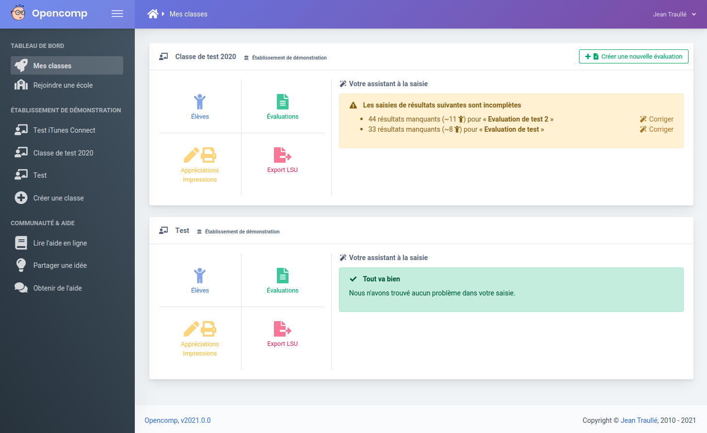
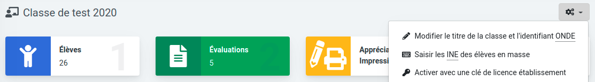
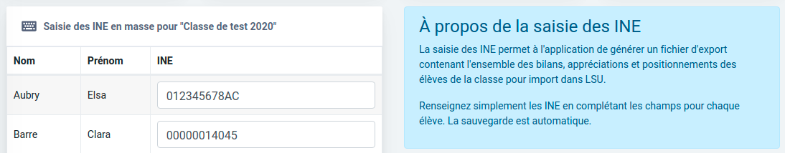
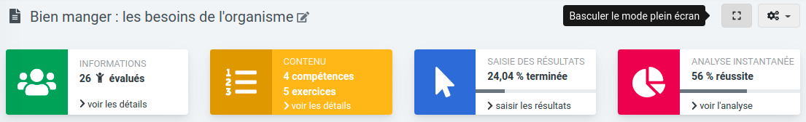
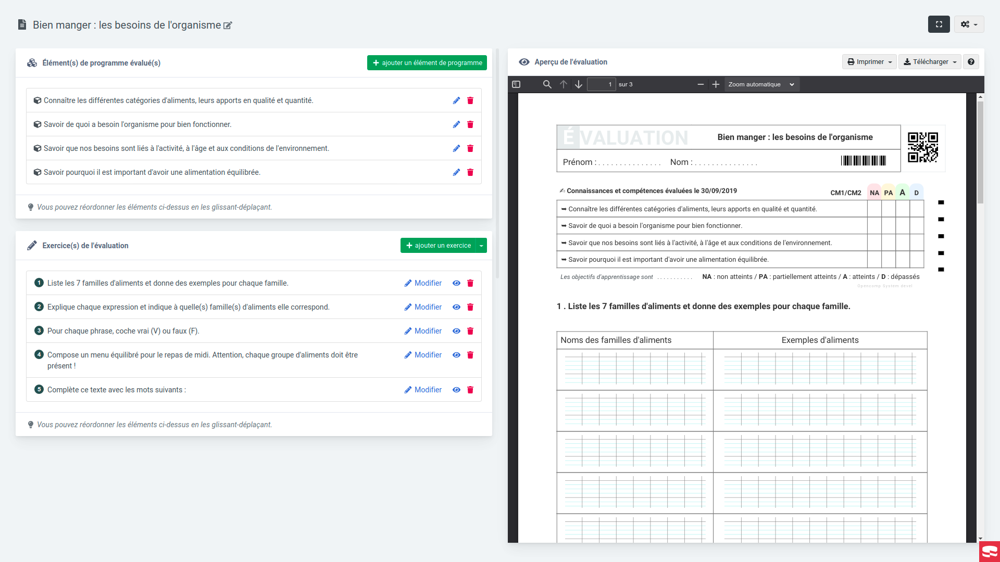
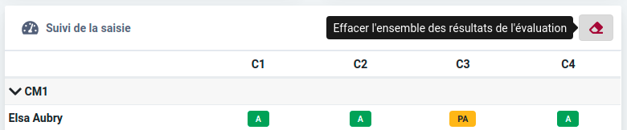

# Version majeure 2021

_Les mises à jour liées à la sécurité et à l'infrastructure sont indiquées par mesure de transparence mais n'entraînent aucun changement visible à votre niveau._

## v2021.0.6 - 12/03/2021

### 🐞 Corrigé

* La suppression d'un élève d'une évaluation existante ne génère plus d'erreur `500` \(merci à _Lucie_\).

### 🔄 Dépendances

* Mise à jour des dépendances **backend** 🛠 

## v2021.0.5 - 05/03/2021

### 🐞 Corrigé

* La récupération automatique des virements entre le compte Stripe et le compte courant vers Dolibarr est de nouveau fonctionnelle.
* L'adresse IP retournée à Sentry prend désormais en compte l'en-tête `X-Forwarded-For`.

## v2021.0.4 - 08/03/2021

### 🔄 Dépendances

* Mise à jour du **langage de script PHP** vers la version **8.0.3**
* Mise à jour des dépendances **frontend** 🎨 

### 🚢 [Intégration continue](https://fr.wikipedia.org/wiki/Int%C3%A9gration_continue) & déploiement continu

* Les plugins CKEditor personnalisés \(réglures Sèyes, Vrai/Faux, Tableaux, Hauteur de ligne, Fraction\) sont désormais installés depuis un dépôt privé **`npm`** sur l'instance Gitlab [`src.opencomp.fr`](https://src.opencomp.fr)

## v2021.0.3 - 04/03/2021

### 🐞 Corrigé

* L'accès à la page `/users/login` redirige désormais de façon permanente vers `/login`.

## v2021.0.2 - 04/03/2021

### 🐞 Corrigé

* L'accès à la page "Réinitialisation de mot de passe" est possible et ne génère plus d'erreur `500`.
* La page de connexion comporte de nouveau les particules animées \(cercles\).

## v2021.0.1 - 03/03/2021

### 🐞 Corrigé

* L'accès à l'application est désormais possible et ne génère plus d'_Internal Server Error_.

## v2021.0.0 - 03/03/2021

### 🆕 Nouvelles fonctionnalités

* Une toute nouvelle identité graphique, rafraîchie et plus en phase avec les attentes actuelles.

* Nouvelle en-tête pour les classes et les évaluations rappelant le titre de la classe ou de l'évaluation active. 
* Les actions relatives à une classe ou à une évaluation en particulier sont maintenant disponibles à partir du bouton déroulant symbolisé par des engrenages à droite de la nouvelle en-tête.

* Possibilité pour les enseignants de saisir/modifier "en masse " les INE des élèves.

* Possibilité d'activer le mode "plein écran" pour la page de conception d'une évaluation \(particulièrement pratique pour les ordinateurs ayant une petite résolution d'écran\).

* Possibilité de supprimer les résultats déjà saisis pour une évaluation

* Un socle technique revu pour une implémentation simplifiée de nouvelles fonctionnalités \(voir section suivante "Dépendances"\).

### ✨ Amélioré

* L'écran présentant le bon de commande d'un abonnement de type "établissement" présente désormais les différents moyens de paiement disponibles sous forme d'onglets, pour une meilleure compréhension du processus.
* La barre latérale est désormais automatiquement rabattue sur les petits écrans afin d'améliorer le confort de travail en permettant d'afficher ainsi plus d'éléments à l'écran.

### 🐞 Corrigé

* Les images sont désormais correctement affichées dans la prévisualisation du contenu des évaluations à importer \(évaluations des années précédentes, évaluations partagées\).
* La fonction d'insertion d'image au sein d'une évaluation a été revue \(lors d'un clic sur l'icône  **Insérer une image**, si aucune image n'est sélectionnée, alors la fenêtre s'ouvre sur l'onglet permettant d'en téléverser une ; dans le cas contraire, l'onglet d'édition des dimensions, de l'alignement et de la légende de l'image sélectionnée apparaît\).
* Correction de l'export \(portabilité des données\) au format .xml lorsque ce dernier comportait certains caractères spéciaux.

### 🗑 Supprimé

* Il n'est désormais plus possible de se connecter en utilisant Facebook \(voir [Dépréciation de l'identification avec Facebook](https://opencomp.fr/actualites/depreciation-de-lidentification-avec-facebook-121)\).

### 🔄 Dépendances

* Mise à jour du **langage de script PHP** vers la version majeure **8.x**
* Mise à jour du **cadriciel CakePHP** vers la version majeure **4.x**
* Mise à jour du **groupeur de modules Webpack** vers la version majeure **5.x**
* Mise à jour du **gestionnaire de dépendances Composer** vers la version majeure **2.x**
* Mise à jour des dépendances **backend** ⚙ 
* Mise à jour des dépendances **frontend** 🎨 
* Mise à jour de la **version d'API du prestataire de traitement des paiements** 💰 **Stripe**.

### 🚢 [Intégration continue](https://fr.wikipedia.org/wiki/Int%C3%A9gration_continue) & déploiement continu

* Mise en place de 🐆 Panther pour l'exécution de tests d'acceptance.
* Utilisation des outils nécessaire à l'intégration continue exclusivement dans le container Docker [**`opencomp/php:8.0-fpm-alpine3.12-dev`**](https://hub.docker.com/r/opencomp/php/tags?page=1&ordering=last_updated&name=8.0-fpm-alpine3.12-dev) \(maintenant inclus dans l'image Docker 🐳ce qui permet de ne pas avoir à installer de dépendances sur le runner\). 

