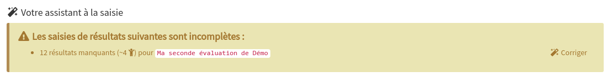

# Saisir les résultats

Dans Opencomp, la saisie des résultats s'effectue par évaluation. Vous avez plusieurs moyens d'accéder à la page permettant de saisir les résultats d'une évaluation :

## Accéder à la saisie des résultats

### Depuis **votre assistant à la saisie**

Lorsque vous vous connectez à l'application, dans votre tableau de bord, votre assistant à la saisie apparaît à droite des boutons d'accès et d'actions rapides et vous indique pour chaque classe les évaluations pour lesquelles l'ensemble des résultats n'ont pas été saisis.

Identifiez la ligne de l'évaluation pour laquelle vous souhaitez saisir les résultats et cliquez sur le lien "**Corriger**" pour accéder directement à la page de saisie des résultats de l'évaluation.


Si vous avez déjà saisi l'ensemble des résultats d'une évaluation et que vous souhaitez les modifier, elle n'apparaîtra pas dans l'assistant à la saisie \(qui n'indique que les évaluations pour lesquelles tous les résultats n'ont pas encore été saisis\). Dans ce cas, utilisez les indications ci-dessous pour modifier les résultats.


### Depuis la liste des évaluations de votre classe


Pour accéder à la page "**Liste des évaluations"** existantes de votre classe, procédez ainsi :

* Depuis le tableau de bord, cliquez sur le bouton "**Évaluations"** dans la section "**Accès rapide"** de votre classe.


1. Identifiez la ligne de l'évaluation pour laquelle vous souhaitez saisir les résultats.
2. Dans la colonne "**Titre de l'évaluation**", cliquez sur le bouton représenté par une roue dentée.
3. Sélectionnez l'élément de menu "**Saisir ou modifier les résultats de l'évaluation**".

### Depuis une évaluation

Si vous êtes déjà dans une évaluation, vous pouvez accéder facilement à la page de saisie des résultats de cette évaluation à l'aide du bandeau d'en-tête à quatre couleurs

* Dans le bloc bleu "**Saisie des résultats**", cliquez sur l'icône blanche représentant un pointeur de souris ou sur le texte d'action "**saisir les résultats**".

## Choisir un mode de saisie

Une fois que vous avez accédé à la page permettant de saisir les résultats de votre évaluations, vous devez choisir un mode de saisie.







