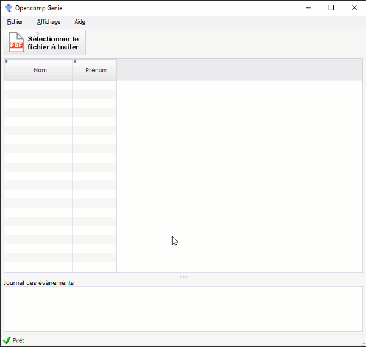

# Détecter les résultats

Lors du premier lancement d'**Opencomp Genie**, vous devez renseigner **votre clé d'API Opencomp**.

Vous trouverez plus d'informations à ce sujet sur la page suivante :



## Processus général d'utilisation

Une fois en possession d'[un fichier PDF contenant la numérisation de vos copies](https://doc.opencomp.fr/saisir-les-resultats/utiliser-opencomp-genie/numeriser-mes-copies), vous pouvez utiliser **Opencomp Genie** pour détecter les résultats :

1. Cliquez sur le bouton **Sélectionner le fichier à traiter**.
2. Sélectionnez [le fichier PDF numérisé précédemment](https://doc.opencomp.fr/saisir-les-resultats/utiliser-opencomp-genie/numeriser-mes-copies).
3. Patientez le temps de la détection par **Opencomp Genie** des résultats de vos copies.
4. Cliquez sur **Envoyer** pour envoyer les résultats sur **Opencomp**.

## En savoir plus sur les différents statuts de traitement possibles



| Code / couleur | Description |
| :--- | :--- |
| DE \(bleu\) | Dépassé détecté |
| A \(vert\) | Atteint détecté |
| PA \(orange\) | Partiellement atteint détecté |
| NA \(rouge\) | Non atteint détecté |
| ! \(rouge\) | Nombre de connaissances et compétences évaluées détecté différent du nombre défini dans Opencomp \(la copie est ignorée\) |
| ? \(gris\) | Le logiciel n'a pas été en mesure de détecter le résultat \(ou vous avez coché deux résultats\). |
| ∅ \(beige\) | Vous avez oublié de corriger pour cette connaissance/compétence évaluée. |

