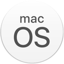

# Installer le logiciel

## Windows \(Vista, 7, 8, 8.1, 10\)



## OS X \(10.11\) ou macOS \(10.12, 10.13, 10.14\)

Le logiciel **Opencomp Genie** fonctionne sur **OS X** \(version 10.11 dite « _El Capitan_ »\) et les versions **macOS** ultérieures \(10.12 dite « _Sierra_ », 10.13 dite « _High Sierra_ », 10.14 dite « _Mojave_ »\).



## Distributions GNU/Linux

Le logiciel **Opencomp Genie** fonctionne sur les distributions GNU/Linux majeures telles que **Ubuntu**, **Debian**, **Fedora**, **Red Hat**, **CentOS**, **openSuse** ou encore **Archlinux**.



